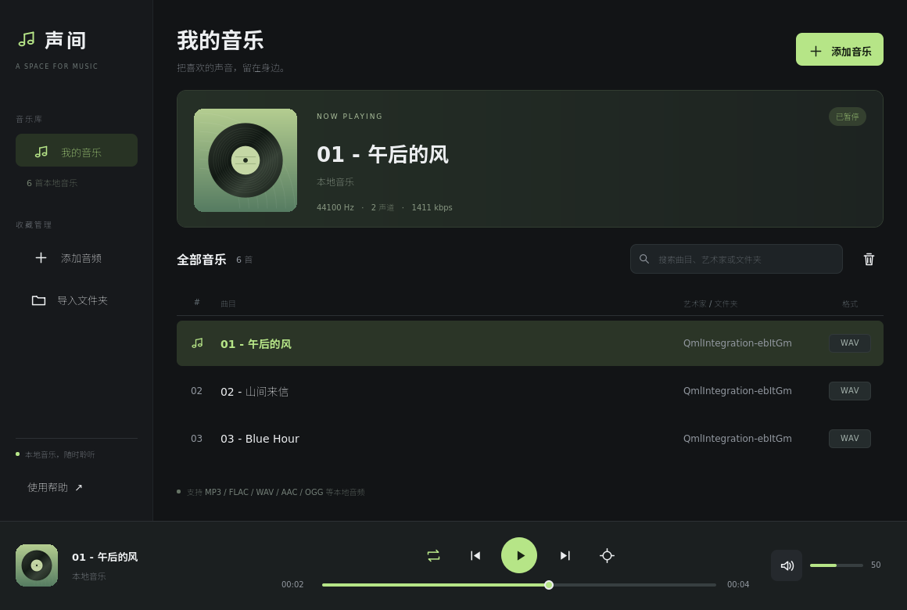

# 声间 · Qt Audio Player

基于 **Qt Quick / QML + C++17 + FFmpeg + PortAudio** 的本地音乐播放器。由原来的 Qt Widgets 项目重构，保留中文界面和原播放列表数据格式。



> 截图来自实际运行的 QML 界面；曲目是测试生成的短音频，唱片图为程序绘制的默认插画。

## 功能

- 深色 QML 界面、可缩放布局、列表虚拟化、键盘焦点和按钮提示。
- 后台流式解码；暂停续播、进度拖动、静音和音量调节。
- 顺序播放、列表循环、单曲循环、随机播放；随机模式在多首曲目时避免立即重复。
- 文件选择、文件夹递归导入、拖放文件/文件夹、命令行导入、重复路径去重。
- 搜索曲目、已读取的艺术家信息、文件夹和格式；Ctrl + 单击多选，移除仅修改列表。
- 记忆列表、音量、静音前音量、播放模式、窗口尺寸和最近导入目录；启动不自动播放。
- 读取当前曲目的标题、艺术家、源采样率、声道数和码率；错误显示在界面底部。

支持的扩展名：MP3、WAV、FLAC、AAC、OGG、M4A、OPUS、AIFF、AIF、WMA。实际解码能力取决于安装的 FFmpeg。

## 构建

需要 C++17 编译器、CMake 3.16+、pkg-config、Qt **5.15 或 6.x**（Core / Gui / Widgets / Quick / QuickControls2 / Concurrent）、FFmpeg **5+** 开发库和 PortAudio 19 开发库。测试另需 Qt Test；压缩格式回归测试使用 `ffmpeg` 命令行生成样本。

推荐使用 Qt 6。以 Ubuntu 24.04 为例：

```bash
sudo apt install build-essential cmake ninja-build pkg-config \
  qt6-base-dev qt6-declarative-dev qt6-declarative-dev-tools \
  qml6-module-qtquick qml6-module-qtquick-controls qml6-module-qtquick-layouts \
  qml6-module-qtquick-window qml6-module-qtquick-templates \
  qml6-module-qtqml qml6-module-qtqml-models qml6-module-qtqml-workerscript \
  libavformat-dev libavcodec-dev libavutil-dev libswresample-dev \
  portaudio19-dev ffmpeg fonts-noto-cjk
cmake -S . -B build -G Ninja -DQT_VERSION_MAJOR=6 -DCMAKE_BUILD_TYPE=Release
cmake --build build -j
./build/audio_player
```

Qt 5.15 使用独立构建目录：

```bash
cmake -S . -B build-qt5 -DQT_VERSION_MAJOR=5 -DCMAKE_BUILD_TYPE=Release
cmake --build build-qt5 -j
```

也保留了 `audio_player.pro`，可以用 Qt Creator 或 Qt 5.15 的 qmake 构建。所有 FFmpeg / PortAudio 路径通过 pkg-config 发现，不再依赖个人 SDK 目录。自定义 SDK 请设置 `PKG_CONFIG_PATH`；非系统 Qt 请设置 `CMAKE_PREFIX_PATH`。Qt Quick Controls 的 QML 运行时模块也必须安装。

```bash
mkdir build-qmake
cd build-qmake
qmake ../audio_player.pro
make -j
```

构建目标当前主要在 Linux 验证。Windows / macOS 需要准备匹配架构的 Qt、FFmpeg、PortAudio 和 pkg-config 元数据，尚未验证原生打包。可使用 `-DBUILD_TESTING=OFF` 只构建播放器。

## 使用

双击列表中的曲目播放。列表高亮表示所选项，绿色音乐图标标识当前曲目。搜索只筛选显示，上一首、下一首及自动切歌仍按完整列表运行；底部定位按钮可回到当前曲目。

| 操作 | 快捷键 |
| --- | --- |
| 播放 / 暂停 | 空格 |
| 添加音频 | Ctrl + O |
| 导入文件夹 | Ctrl + Shift + O |
| 搜索 | Ctrl + F |
| 上一首 / 下一首 | Ctrl + ← / → |
| 静音 / 恢复 | M |
| 从列表移除选中项 | Delete |
| 清空搜索 | Esc |
| 列表键盘选择 / 播放 | ↑ ↓ / Enter |

搜索输入时，空格、M、Delete 保留文本编辑行为。顺序播放在最后一首结束后停止，列表循环才会回到首曲。暂停状态下拖动进度不会自动开始播放。

命令行也可以传入文件或文件夹：

```bash
./build/audio_player /path/to/music /path/to/song.flac
```

音频输出使用系统默认设备，统一为 **48 kHz、双声道、float32**；界面显示的是源文件参数。不支持该格式或没有设备时会提示错误。唱片插画为默认视觉元素，当前尚未提取内嵌封面。艺术家标签在曲目首次打开时读取，未做全库标签预扫描。

## 测试

```bash
ctest --test-dir build --output-on-failure
```

测试覆盖环形缓冲并发、解码排空与重采样、跳转、播放状态、列表增删、导入与持久化，以及真实 QML 加载、按钮、搜索、进度交互和窗口缩放。测试使用临时文件与独立设置目录，不改动用户音乐库。

播放测试通过独立的模拟 PortAudio 设备按真实时间消耗 PCM，生产程序仍链接真实 PortAudio。测试通过不能替代实体音频设备的试听。压缩格式测试在缺少 `ffmpeg` 命令时会明确跳过。

生成真实界面截图（需要 X11 显示环境或 Xvfb）：

```bash
QT_QPA_PLATFORM=xcb QT_QUICK_BACKEND=software \
  PLAYER_SCREENSHOT_DIR="$PWD/docs/screenshots" ./build/tests/test_qml
```

无桌面环境下可使用 `QT_QPA_PLATFORM=offscreen QT_QUICK_BACKEND=software` 做冒烟测试。Linux 中文显示为方框时请安装 Noto CJK 等中文字体。

## CI 与 tag 构建

GitHub Actions 在分支推送、tag 推送、Pull Request 和手动触发时运行 Qt 5 / Qt 6 的 Linux 构建与测试。推送任意 tag（例如 `v2.0.0`）后，测试通过会分别上传两个构建产物，名称包含 Qt 主版本和提交 SHA，可在该次 Actions 运行页面下载，保留 30 天。

产物包含 `bin/audio_player`、README 与文档，使用 Ubuntu 24.04 的动态链接依赖；它不是自包含安装包，运行机器仍需安装对应 Qt/QML、FFmpeg 和 PortAudio 运行库。工作流不自动创建 GitHub Release。

详细的原项目分析、架构变化和后续建议见 [重构说明](docs/REFACTOR.md)。
