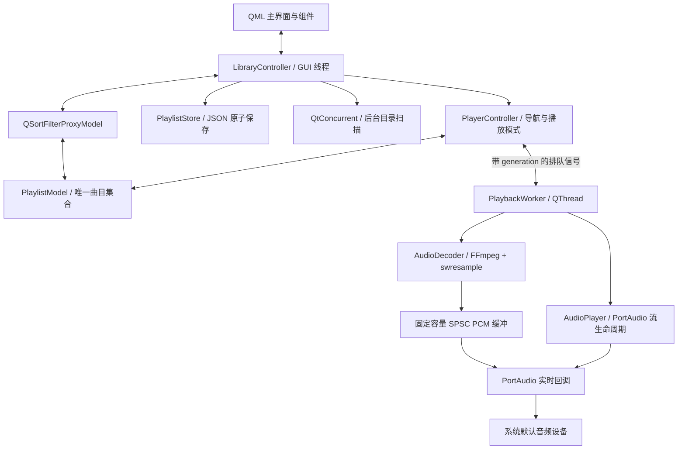

# 项目梳理与重构说明

## 原项目的结构与问题

原版是 Qt 5 Widgets 桌面应用：`MainWindow` 负责交互、列表与存储，`UIManager` 创建控件，`PlayerController` 调用 `AudioDecoder` 和 `AudioPlayer`。FFmpeg 解码、PortAudio 输出这条技术路线适合本地音乐播放器，主要问题出在执行线程、状态管理和 UI 数据组织。

| 原实现 | 影响 | 本轮处理 |
| --- | --- | --- |
| `startDecodingAndPlaying()` 在 GUI 线程循环解码整首歌曲 | 大文件导入播放时卡顿，PCM 内存随时长增加 | 独立 QThread，按需填充有界缓冲 |
| 音频流先启动、后填充，缓冲为空就返回 `paComplete` | 启动/短暂欠载时提前结束 | 预填充，独立 EOF 标记，欠载补静音 |
| 回调持 mutex 并逐字节删除 deque | 实时线程可能等待锁，增加抖动 | 预分配 SPSC float 环形缓冲，无锁、无分配、无 Qt 调用 |
| 播放按钮暂停后重新 `play()` | 无法续播 | 明确 Stopped / Loading / Playing / Paused 状态 |
| 进度拖动槽被注释，定时器固定累加 200 ms | 跳转不可用，显示进度漂移 | 消费 PCM 帧数统计；暂停输出后 seek、flush、预填充 |
| FFmpeg 未发送空包排空解码器，未排空 resampler | 丢尾帧；将暂时无输出与 EOF 混淆 | 区分 Data / End / Error，完整 drain |
| 输出通道被设备裁减，回调仍按原通道数写入 | 可能越界写输出缓冲 | 统一格式并验证设备能力，不隐式改通道数 |
| 码率已经是 kbps，controller 再除以 1000 | 元数据显示错误 | 单一 kbps 单位接口 |
| `setPlaylist()` 每次都重置当前索引 | 添加/删除曲目破坏当前播放状态 | 模型是唯一列表来源，当前曲目按规范化路径跟踪 |
| 删除任意歌曲都停止播放 | 日常整理列表时打断播放 | 仅删除当前曲目时停止 |
| 顺序播放实际循环，空列表自动切歌未防护 | 行为与名称不符，存在除零风险 | 明确四种模式、空列表边界、随机避免立即重复 |
| 每首歌创建 QWidget，主窗/控制器各存一份列表 | 数据同步复杂，大列表控件开销高 | C++ 模型 + QSortFilterProxyModel + QML ListView 复用委托 |
| QSS 分散且资源样式与代码样式不一致 | 改一处无法统一主题 | QML 组件 + Theme.js 集中颜色 |
| TTS/STT/音频提取为占位弹窗，设备设置为示例数据 | 用户看到无法工作的入口 | 移除未实现入口，集中完善本地播放 |
| `.pro` 写死 `/home/ytq/sdk/...` | 换机器无法直接构建 | CMake / qmake + pkg-config，减少无用 FFmpeg 链接项 |
| 直接写 `playlist.json`，没有解析/保存错误反馈 | 写入中断可能损坏文件 | QSaveFile 原子提交，坏文件备份，界面错误反馈 |

## 为什么采用 QML

按本次需求将主界面改为 Qt Quick / QML，适合可缩放布局、状态绑定、组件复用和后续交互动效。音频解码和实时输出保留在 C++，避免在 JavaScript 中处理 PCM。

没有同时保留两套主界面；原 `MainWindow`、`UIManager`、逐行 Widget、滚动标题和废弃的 WAV/波形辅助代码已移除，历史代码仍可从 Git 查询。Qt Widgets 依赖仅用于跨 Qt 5/6 的系统文件选择对话框。

## 当前架构

| 文件 / 目录 | 职责 |
| --- | --- |
| `qml/Main.qml` | 主窗口、侧栏、音乐列表、搜索、拖放、帮助和快捷键 |
| `qml/PlayerBar.qml` | 播放控制、进度、音量、定位当前曲目 |
| `qml/TrackRow.qml` | 可复用列表委托、选择和菜单 |
| `qml/ActionButton.qml`、`PlayerSlider.qml` | 控件外观、焦点、提示及交互 |
| `qml/RecordArtwork.qml`、`Icon.qml` | Canvas 默认唱片插画和可缩放图标，不依赖额外位图生成 |
| `qml/Theme.js` | 共享主题颜色 |
| `librarycontroller.*` | Q_PROPERTY / Q_INVOKABLE 桥接、设置、导入和用户反馈 |
| `playlistmodel.*`、`playliststore.*` | 规范化路径、标签、选中状态、列表存储 |
| `libraryimporter.*` | 后台递归扫描、去重和可取消导入 |
| `playercontroller.*` | 播放会话、列表导航、播放模式，过滤旧请求的迟到事件 |
| `playbackworker.*` | 唯一拥有解码器/输出流的工作线程，10 ms 填充检查 |
| `audiodecoder.*` | FFmpeg 解复用、解码、重采样、源标签、seek 和 drain |
| `audioplayer.*`、`pcmbuffer.h` | PortAudio 生命周期、固定缓冲、音量和 PCM 消费统计 |
| `tests/` | 核心回归、模拟输出设备和 QML 集成测试 |

## 关键约束

- GUI 线程操作模型；工作线程操作解码器和 PortAudio 流。回调只消费预分配 PCM、缩放音量、更新原子计数。
- 环形缓冲为 131072 个 float（512 KiB）；通常保持约 300 ms 数据，另有一个待写入的解码帧。内存不再随整曲长度增长。
- 每次填充最多处理 24 个块，使暂停、停止和跳转请求能进入工作线程事件循环。
- 欠载补静音且不增加曲目播放进度；只有 EOF、PCM 耗尽及设备流停止三者成立才自动切歌。
- 帧数反映已交给输出回调的音频，仍有设备输出延迟，不是扬声器声学反馈。
- seek 先停止回调，清理环形缓冲、解码器及重采样器状态，再按流时间戳裁剪预滚音频；暂停时 seek 保持暂停。
- 当前输出统一为 48 kHz、立体声 float32，不支持该格式的默认设备会报错。当前依赖无锁 64 位原子计数，验证平台为 x86_64。
- 切歌/停止递增 generation，GUI 丢弃旧会话的状态、错误、结束通知，防止快速操作后界面跳回旧歌曲。
- 文件夹扫描不跟随目录符号链接，避免目录循环；导入同一文件的符号链接与真实路径会按 canonical path 去重。
- QML 通过只读角色显示模型数据，不保存第二份播放列表。搜索用固定字符串而非正则表达式，输入特殊字符不改变匹配语义。

## 数据兼容与行为变化

保留应用标识 `BitZion / AudioPlayer` 和 `QStandardPaths::AppDataLocation/playlist.json`，旧版 JSON 字符串数组可直接恢复。加载会跳过失效路径和重复项；不会删除源音频。

列表变更后延迟 300 ms 合并保存，关闭时补存。损坏文件先复制为 `playlist.json.broken-时间戳` 再允许保存新列表；若备份失败则保留原文件并停止覆盖。设置通过 QSettings 存储。启动恢复收藏和偏好，但不自动发声。

“顺序播放”现在在末曲结束后停止；原版的回首曲行为对应“列表循环”。手动上一首/下一首仍可绕回首尾。随机播放暂未维护历史栈，上一首也是重新随机选择。

## 验证与后续方向

本轮验证采用 Qt 5.15.11 / Qt 6.6.2、FFmpeg 7.0.2、PortAudio 19、GCC 12、Linux x86_64。核心测试与 QML 集成测试分别运行；截图使用 Xvfb + Qt Quick 软件渲染。覆盖真实 QML 加载、按钮与滑块输入、文字编辑快捷键、多选、筛选后播放映射、窗口缩放、设置恢复。压缩格式测试将输出样本数与 ffmpeg 命令行解码结果比较。

| 验证项 | 本地结果 |
| --- | --- |
| Qt 5.15.11 / CMake | 构建通过；核心 16 项、QML 4 项通过（含测试初始化与清理） |
| Qt 6.6.2 / CMake | 构建通过；核心 16 项、QML 4 项通过（含测试初始化与清理） |
| Qt 5.15.11 / qmake | 构建通过 |
| QML 截图 | 空列表、已导入音乐库、880 × 640 小窗口，中文显示正常 |
| GitHub Actions | 已加入 Qt 5 / 6 矩阵配置，尚未在远端执行 |

本机的 `qmake6` 在处理最小示例工程时也发生子进程崩溃，Qt 6 验证因此使用 CMake。Qt 6 测试生成音频样本时显式使用 fork 子进程，以兼容当前主机的 vfork 拦截环境；这只影响测试辅助命令，不涉及生产音频路径。

自动化音频测试使用按时钟推进的模拟输出设备，未完成实体耳机/扬声器的音质、延迟、热插拔及长时间试听。Windows/macOS 的设备后端和发布包也尚未验证。

建议后续按价值依次推进：

1. 在目标机器完成真实设备验收，加入设备选择、采样率协商和热插拔恢复。
2. 后台标签索引、专辑封面、专辑/艺术家视图；大规模音乐库迁移到 SQLite 并缓存标签。
3. LRC 歌词、播放历史、随机模式历史栈，以及可选的淡入淡出/无缝播放。
4. Windows/macOS/Linux 的安装包、运行时依赖部署和自动发布。

TTS、STT、网络音乐和音频提取属于独立功能方向，本轮未实现，也不在界面放置占位入口。
